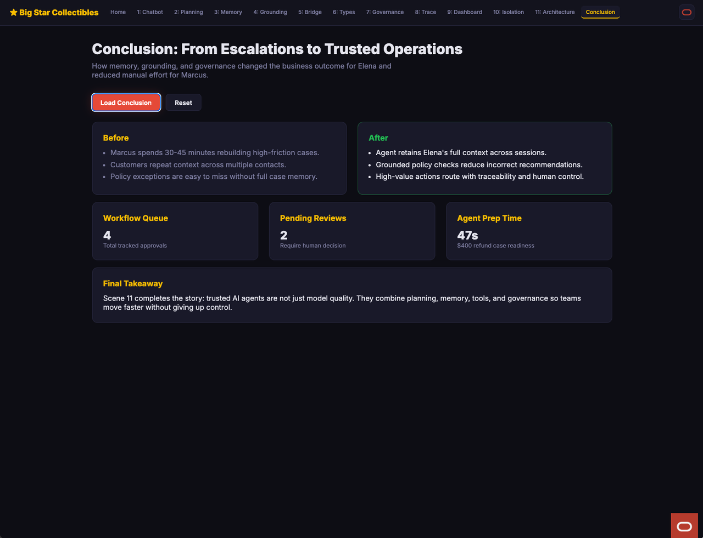

# Conclusion and Business Outcomes

## Introduction

This closing lab consolidates the full workshop story. You summarize what changed for customers, support teams, and decision governance.

Estimated Time: 10 minutes

### Objectives

In this lab, you will:
- Open the conclusion scene.
- Review before-and-after business outcomes.
- Capture a concise value narrative for stakeholder discussion.

## Task 1: Load the Conclusion Scene

1. Open **Conclusion: From Escalations to Trusted Operations**.
2. Click **Load Conclusion**.
3. Review the before-and-after panels.

Expected result:
- A business summary appears with outcome-oriented comparisons.
- The message connects customer continuity, decision quality, and oversight.
- The scene provides a closing narrative for executive audiences.

## Task 2: Review the Outcome Signals

1. Focus on the operational indicators displayed in the conclusion cards.
2. Compare workflow pressure, pending reviews, and preparation speed.
3. Identify where the operating model reduced manual effort.

Expected result:
- You can describe concrete indicators of operational maturity.
- You can show how human review remains in control for higher-risk actions.
- You can communicate value beyond technical performance claims.

## Task 3: Why this matters?

Across the workshop, the central takeaway is that sustainable AI value comes from combining response quality, memory continuity, and governance discipline on one operational data foundation. Oracle AI Database 26ai's converged architecture is compelling in this context because it keeps transactional truth, AI retrieval patterns, workflow state, and control evidence aligned over time. For customers running AI-agent workflows, that alignment supports faster scale-up with stronger reliability, better auditability, and less architectural complexity.

## Credits & Build Notes
- **Author** - LiveLabs Team
- **Last Updated By/Date** - LiveLabs Team, March 2026
