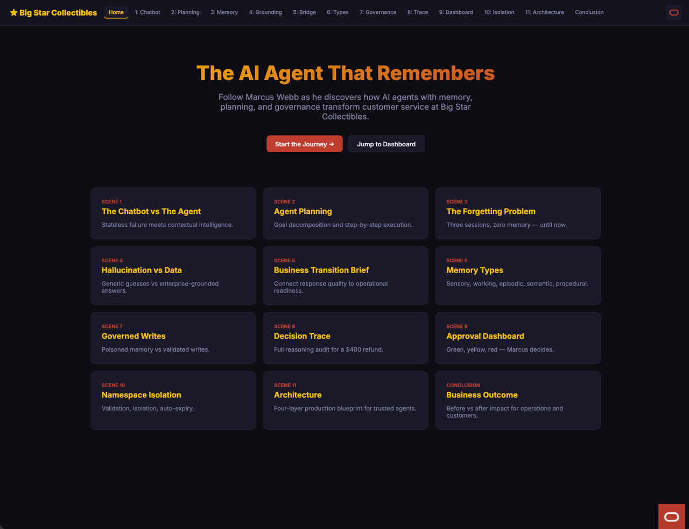

# Big Star Memory Agent Workshop

## Introduction

This workshop walks through a customer-support story from a business point of view. Each lab follows one scene in the Big Star dashboard, focusing on what a user clicks, what appears on screen, and what business decision is made.

Estimated Demo Time: 1 hour 30 minutes

>Note: If you install demo in your environment, you should plan another 30 minutes.

### Objectives

In this workshop, you will:
- Run each scene in the dashboard using the scene buttons.
- Compare weak and strong agent behaviors in realistic support cases.
- See how memory, grounding, and governance improve customer outcomes.
- Understand where manager approval is needed for higher-risk decisions.

### Prerequisites

This workshop assumes you have:
- Access to the running Big Star demo UI.
- A browser session open to the workshop application.
- Basic familiarity with customer support workflows.

## Workshop Flow

- Scene 1: Chatbot versus memory-enabled agent.
- Scene 2: Planning before action.
- Scene 3: Why memory continuity matters.
- Scene 4: Grounded answers versus guesses.
- Scene 5: Transition from response quality to operational readiness.
- Scene 6: Memory types in action.
- Scene 7: Governed versus ungoverned writes.
- Scene 8: Explainable decision trace.
- Scene 9: Manager approval dashboard.
- Scene 10: Isolation and auto-expiry controls.
- Scene 11: Architecture as the operating model.
- Conclusion and business outcomes.
- Download the LiveStack, run the portable stack with Podman Compose.

## Learn More

- [Oracle AI Database JSON Developer's Guide](https://docs.oracle.com/en/database/oracle/oracle-database/26/adjsn/index.html)
- [JSON Search Index for Ad Hoc Queries and Full-Text Search](https://docs.oracle.com/en/database/oracle/oracle-database/26/adjsn/json-search-index-ad-hoc-queries-and-full-text-search.html)
- [Oracle Data Redaction and JSON](https://docs.oracle.com/en/database/oracle/oracle-database/26/dbred/oracle-data-redaction-and-json.html)

## Credits & Build Notes
- **Author** - LiveLabs Team
- **Last Updated By/Date** - LiveLabs Team, March 2026
