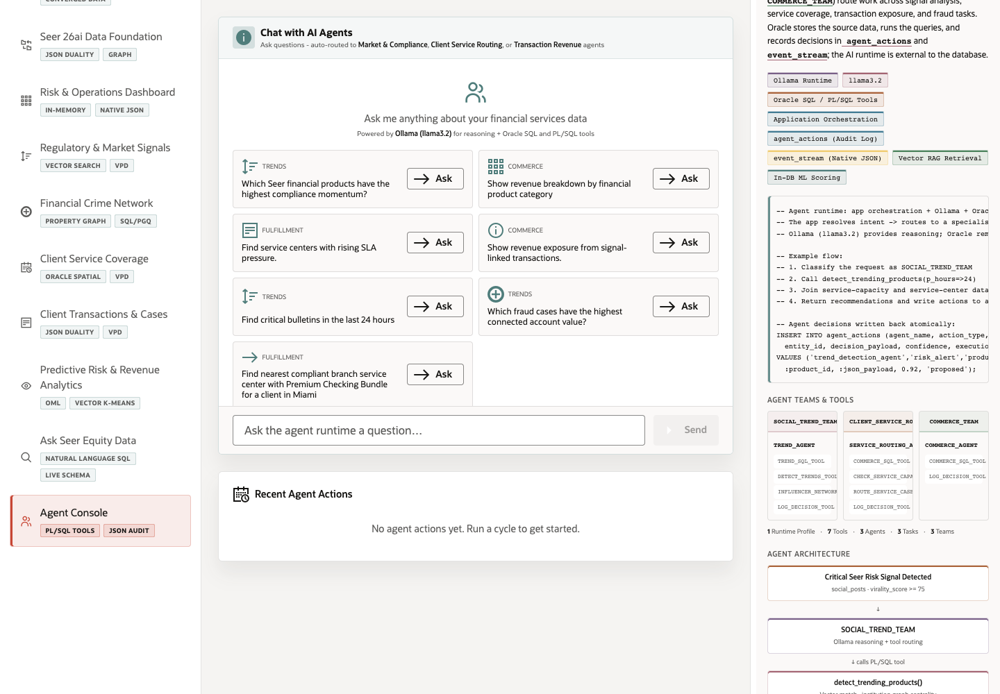

# Conclusion and Business Outcomes

## Introduction

This closing lab consolidates the Seer Equity Bank Finance LiveStack story. The demo starts with a governed finance data foundation and ends with AI-assisted operators, auditors, analysts, and service teams working from the same Oracle-backed source of truth.

Estimated Time: 10 minutes

### Objectives

In this lab, you will:
- Review the final operator narrative across the scenes.
- Connect visible application workflows to Oracle AI Database 26ai capabilities.
- Summarize the business outcome for a stakeholder discussion.

## Task 1: Review the end-to-end story

1. Return to **Risk & Operations Dashboard** and note the operational summary cards.
2. Open **Regulatory & Market Signals** and **Financial Crime Network** to review how signal and graph evidence explain the risk picture.
3. Open **Predictive Risk & Revenue Analytics** and **Agent Console** to review how the app turns governed data into recommendations and logged actions.

Expected result:
- You can describe how the demo moves from trusted finance data to risk insight, investigation, service response, predictive analytics, and agent-assisted decisions.

## Task 2: Review the Oracle evidence

1. In any scene, expand or review the **Oracle Internals** panel.
2. Identify the Oracle capability badges and SQL or PL/SQL evidence for the current workflow.
3. Compare scenes that use different engines: JSON Duality, Vector Search, Property Graph, Spatial, VPD, OML, Select AI-style natural-language SQL, and agent audit tables.

Expected result:
- The same application shell shows multiple finance workflows, but Oracle AI Database 26ai remains the shared data and execution layer.
- The Oracle Internals panel gives the presenter concrete evidence instead of relying on generic architecture claims.

## Task 3: Capture the stakeholder narrative

1. Summarize the demo in one sentence: Seer Equity Bank serves finance data, risk intelligence, fraud relationships, service coverage, analytics, and AI workflows from one governed Oracle data foundation.
2. Identify which scene matters most for your audience:
   - Executives: dashboard outcomes and predictive risk.
   - Risk and fraud teams: regulatory signals and crime network.
   - Operations teams: client service coverage and case routing.
   - Data leaders: data foundation, dataset manager, and Oracle Internals.
3. Use **Use Your Own Data** as the next-step call to action when a customer wants to map the story to their own finance data.

Expected result:
- You have a concise value narrative and a recommended next step for a follow-up customer workshop.

## Task 4: Why this matters?

Financial institutions often split dashboards, search, fraud graphs, geospatial service logic, ML, and AI agents across separate systems. This LiveStack demonstrates the business alternative: keep governed data close to Oracle, expose it through application scenes, and let every operator workflow reuse the same trusted foundation.

## Credits & Build Notes
- **Author** - LiveLabs Team
- **Last Updated By/Date** - LiveLabs Team, 2026-05-11
- **Build Notes** - The conclusion references the current app navigation and the final Agent Console scene.
