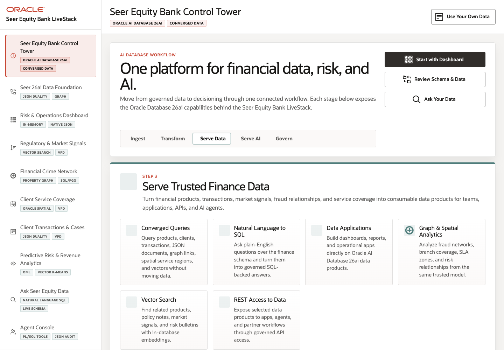

# Scene 1 Seer Equity Bank Control Tower

## Introduction

The control tower is the opening scene for the finance LiveStack. It orients the presenter around the application story: Seer Equity Bank serves finance data, risk workflows, API-backed applications, and AI experiences from one Oracle AI Database 26ai foundation.

Estimated Time: 8 minutes

### Objectives

In this lab, you will:
- Open the Seer Equity Bank LiveStack.
- Review the left navigation and the primary story paths.
- Use the quick actions to move into the dashboard, data foundation, or natural-language experience.

## Task 1: Open the control tower

1. Open the running application at `http://localhost:8505`.
2. Confirm the left navigation starts with **Seer Equity Bank Control Tower**.
3. Review the workflow stage track: **Ingest**, **Transform**, **Serve Data**, **Serve AI**, and **Govern**.

Expected result:
- The application opens to the control tower scene.
- The presenter can introduce the demo as a finance data and AI workflow, not as a collection of disconnected dashboards.

## Task 2: Review the main story paths

1. In the welcome panel, review the capability cards for converged queries, natural-language SQL, data applications, graph and spatial analytics, vector search, and REST access.
2. Click **Start with Dashboard**.
3. Return to the control tower by clicking **Seer Equity Bank Control Tower** in the left navigation.
4. Click **Review Schema & Data**, then return again.
5. Click **Ask Your Data**, then return again.

Expected result:
- Each quick action moves to a real application scene.
- The left navigation remains the control point for the whole demo story.

## Task 3: Identify the persistent operator controls

1. Locate the top action labeled **Use Your Own Data**.
2. Locate the left sidebar **Customer name** control.
3. Locate the active dataset label in the sidebar footer.

Expected result:
- The user sees that the LiveStack can be narrated as the default Seer Equity Bank demo or adapted to a customer name and customer dataset.
- Dataset status stays visible throughout the app.

## Task 4: Why this matters?

This first scene gives the audience a mental model for the rest of the workshop. Every later scene should be positioned as another operator view on the same governed Oracle-backed finance data foundation.

## Credits & Build Notes
- **Author** - LiveLabs Team
- **Last Updated By/Date** - LiveLabs Team, 2026-05-11
