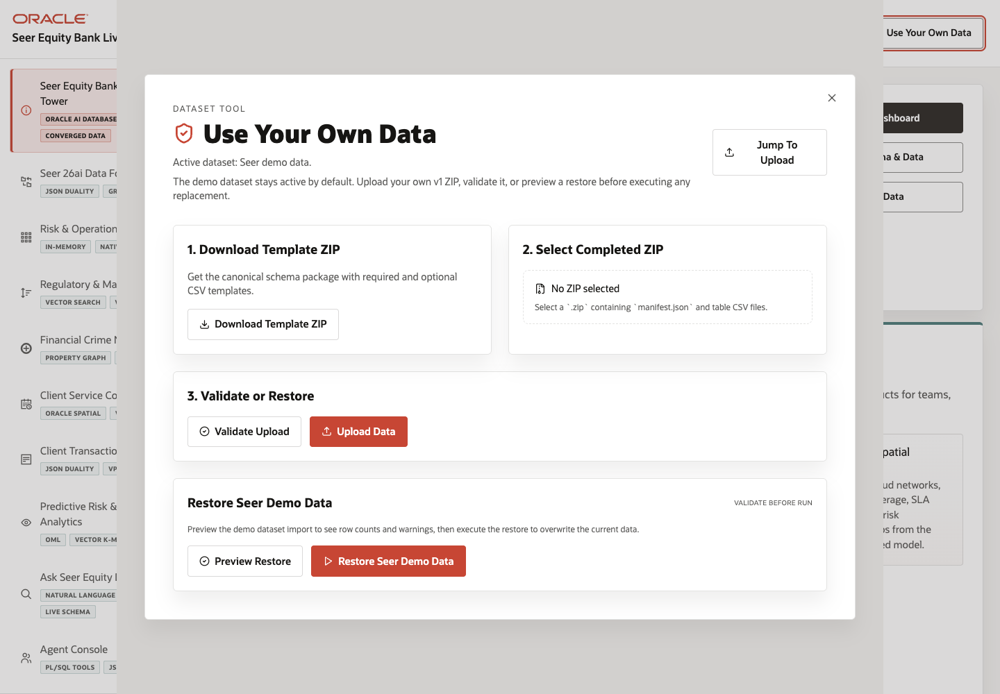

# Scene 11 Use Your Own Data

## Introduction

The dataset manager is the customer-data entry point for the LiveStack. It lets an operator download the template ZIP, select a completed ZIP, validate it, upload it, preview a restore, or restore the Seer demo dataset.

Estimated Time: 12 minutes

### Objectives

In this lab, you will:
- Open the dataset manager overlay.
- Download the data template.
- Validate or upload a completed dataset.
- Restore demo data when needed.

## Task 1: Open the dataset manager

1. Click **Use Your Own Data** in the top bar.
2. Review the modal title and active dataset line.
3. Locate the close button in the top-right corner.

Expected result:
- The dataset manager opens over the current scene.
- The rest of the app remains visible behind the modal, reinforcing that dataset operations affect the current LiveStack.

## Task 2: Download and prepare the template

1. Click **Download Template ZIP**.
2. Extract the template locally.
3. Fill the required CSV files and optional CSV files described in the template README.
4. Re-zip the completed files with `manifest.json` at the expected level.

Expected result:
- The user has a completed v1 import ZIP that follows the finance LiveStack schema contract.

## Task 3: Validate or upload customer data

1. Click the file selection area under **Select Completed ZIP**.
2. Choose the completed dataset ZIP.
3. Click **Validate Upload** to run a dry run.
4. If validation succeeds, click **Upload Data**.
5. Watch the job status panel until it reports completion.

Expected result:
- Validation reports row counts, warnings, or blocking errors before destructive replacement.
- Upload replaces the active Oracle-backed dataset and refreshes derived artifacts such as spatial geometry, vector embeddings, graph links, and fallback optional data.

## Task 4: Restore Seer demo data

1. Click **Preview Restore** under **Restore Seer Demo Data**.
2. Review the restore preview.
3. Click **Restore Seer Demo Data** only when you want to overwrite the active dataset with the bundled demo data.

Expected result:
- The app returns to the default Seer Equity Bank dataset.
- The sidebar active dataset label updates after the restore completes.

## Task 5: Why this matters?

LiveStacks are strongest when customers can bring their own data into the same workflow. This scene turns the finance demo from a fixed sample into a repeatable onboarding pattern with validation, upload, status tracking, and a safe restore path.

## Credits & Build Notes
- **Author** - LiveLabs Team
- **Last Updated By/Date** - LiveLabs Team, 2026-05-11
