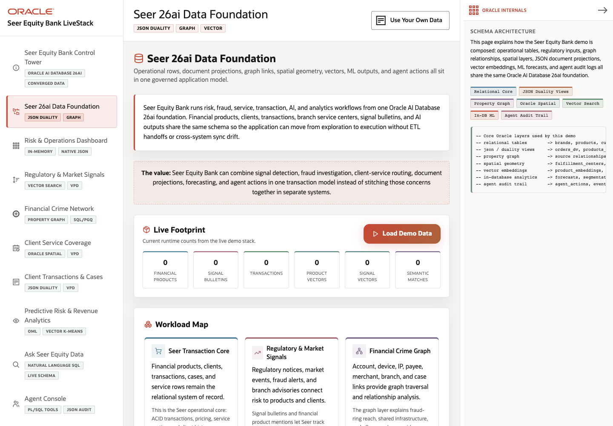

# Scene 2 Seer 26ai Data Foundation

## Introduction

This scene explains the data foundation behind the LiveStack. It shows the major Oracle-backed layers used by the finance app: relational tables, JSON document projections, property graph relationships, spatial geometry, vector embeddings, in-database ML outputs, and agent audit logs.

Estimated Time: 10 minutes

### Objectives

In this lab, you will:
- Open the data foundation scene.
- Review the live footprint and workload map.
- Use the quick routes to connect the data model to later operator scenes.
- Inspect the Oracle Internals panel for the core data architecture.

## Task 1: Open the data foundation

1. Click **Seer 26ai Data Foundation** in the left navigation.
2. Read the opening value statement.
3. Review the **Live Footprint** section and the counts for products, signals, transactions, vectors, and related artifacts.

Expected result:
- The user understands that the app is not moving data between isolated systems.
- The scene describes one governed model used by risk, fraud, service, transactions, AI, and analytics workflows.

## Task 2: Review the workload map

1. Scroll to **Workload Map**.
2. Compare the cards for operational finance data, regulatory inputs, fraud graph, spatial coverage, predictive intelligence, and agent action logs.
3. Continue to **How The Data Connects** and follow the flow from ingested finance data through served application and AI experiences.

Expected result:
- The user can explain which parts of the application depend on each Oracle capability.
- The flow sets up the rest of the demo scenes.

## Task 3: Use quick routes

1. Scroll to **Quick Routes**.
2. Click one route, such as **Risk & Operations Dashboard** or **Ask Seer Equity Data**.
3. Return to **Seer 26ai Data Foundation** from the left navigation.

Expected result:
- The data foundation acts as a map into the operator scenes.
- The presenter can move from architecture to application behavior without leaving the app.

## Task 4: Inspect Oracle Internals

1. Review the **Oracle Internals** panel on the right.
2. Note the feature badges for relational core, JSON Duality Views, Property Graph, Oracle Spatial, Vector Search, in-database ML, and agent audit trail.
3. Use the SQL evidence as the technical proof point for the data foundation.

Expected result:
- The user sees how the visible application model maps to concrete Oracle database objects and features.

## Task 5: Why this matters?

Financial services teams need analytics, fraud, client service, risk, and AI workflows to share governed data. This scene establishes Oracle AI Database 26ai as the foundation before the demo moves into specific operator actions.

## Credits & Build Notes
- **Author** - LiveLabs Team
- **Last Updated By/Date** - LiveLabs Team, 2026-05-11
