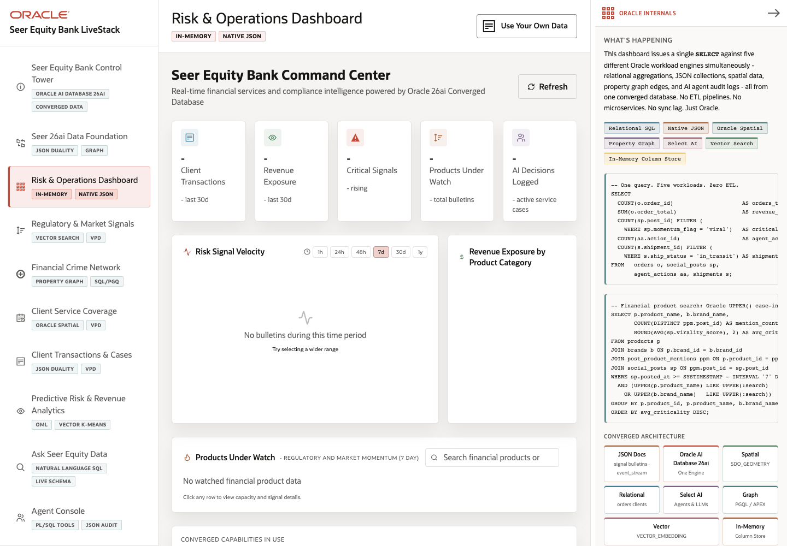

# Scene 3 Risk and Operations Dashboard

## Introduction

The Risk & Operations Dashboard is the executive and operator command center. It combines transaction volume, revenue exposure, critical signals, watched products, service activity, and AI decision logging into one finance operations view.

Estimated Time: 10 minutes

### Objectives

In this lab, you will:
- Open the command center.
- Refresh the summary and review the operational cards.
- Search and inspect products under watch.
- Connect the dashboard to Oracle Internals evidence.

## Task 1: Open the dashboard

1. Click **Risk & Operations Dashboard** in the left navigation.
2. Review the five summary cards: client transactions, revenue exposure, critical signals, products under watch, and AI decisions logged.
3. Click **Refresh**.

Expected result:
- The dashboard refreshes from the app API.
- With the full Podman stack healthy, the cards populate from live Oracle-backed queries.

## Task 2: Compare risk velocity and revenue exposure

1. Review **Risk Signal Velocity**.
2. Change the range between **1h**, **24h**, **48h**, **7d**, **30d**, and **1y**.
3. Review **Revenue Exposure by Product Category**.

Expected result:
- The time-range buttons change the risk velocity view.
- The revenue chart helps connect market or regulatory pressure to product exposure.

## Task 3: Investigate products under watch

1. In **Products Under Watch**, search for a product or institution.
2. Select an institution chip when chips are available.
3. Click a product row to open the detail panel.
4. Compare the details view with the JSON tab when available.

Expected result:
- The user can move from summary risk into a specific product or institution.
- The app demonstrates how operational SQL, JSON payloads, vector-matched signals, and service data can be presented in one dashboard.

## Task 4: Inspect Oracle Internals

1. Review the **Oracle Internals** panel.
2. Point out the badges for relational SQL, native JSON, Oracle Spatial, Property Graph, Select AI, Vector Search, and In-Memory Column Store.
3. Use the SQL snippets to explain that the dashboard is not a stitched microservice view.

Expected result:
- The audience sees the dashboard as a converged Oracle workload rather than a set of separate data marts.

## Task 5: Why this matters?

Risk teams need to move from aggregate indicators to explainable product and signal evidence quickly. This dashboard shows how Oracle-backed data products can support that workflow without duplicating governed finance data into specialized stores.

## Credits & Build Notes
- **Author** - LiveLabs Team
- **Last Updated By/Date** - LiveLabs Team, 2026-05-11
