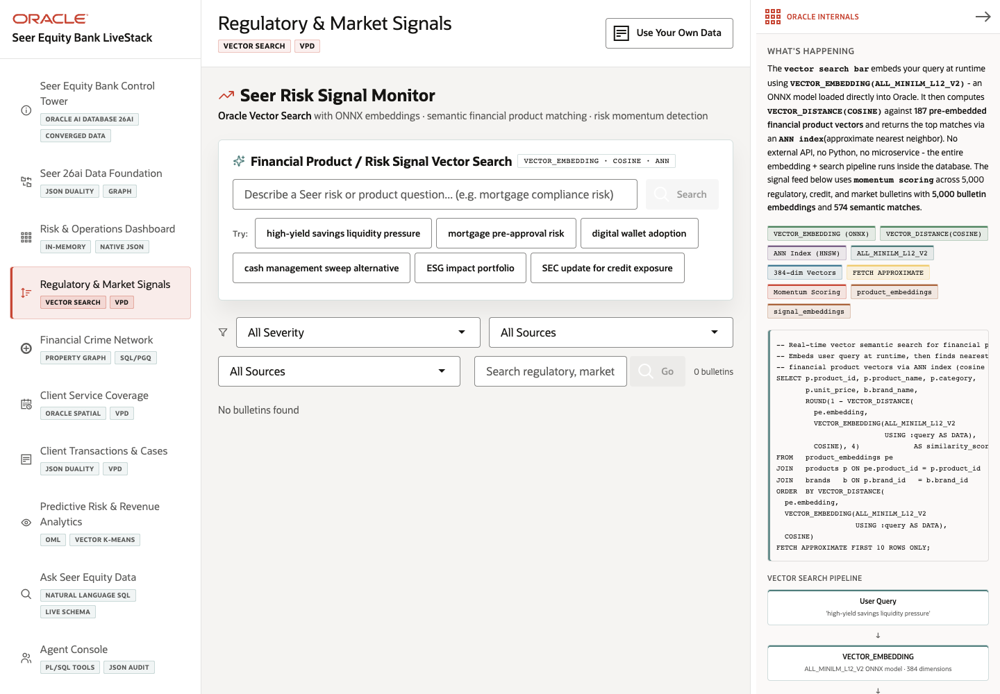

# Scene 4 Regulatory and Market Signals

## Introduction

This scene shows how Seer Equity Bank uses Oracle Vector Search to match regulatory, market, and fraud signals to related financial products. Operators can search by plain business meaning rather than exact keywords.

Estimated Time: 10 minutes

### Objectives

In this lab, you will:
- Open the signal monitor.
- Run semantic product and signal searches.
- Filter the signal feed.
- Inspect the Oracle vector and VPD evidence.

## Task 1: Open the signal monitor

1. Click **Regulatory & Market Signals** in the left navigation.
2. Review the **Financial Product / Risk Signal Vector Search** panel.
3. Read the feature chip showing `VECTOR_EMBEDDING`, cosine distance, and approximate nearest-neighbor search.

Expected result:
- The scene opens on a semantic search workflow for finance risk signals.
- The user understands that the search compares vector meaning, not only text tokens.

## Task 2: Run vector search

1. Enter a phrase such as `mortgage compliance risk`.
2. Click **Search**.
3. If example buttons are visible, click one example query and compare the returned products.
4. Click **Clear** before moving on.

Expected result:
- With the full stack healthy, the app returns matched financial products with model metadata, dimensions, and similarity scores.
- The results help explain why a signal belongs with a product or business line.

## Task 3: Filter the signal feed

1. Use **All Severity** to choose a severity level such as **Critical** or **High**.
2. Use **All Sources** to filter by source type.
3. Use the signal search field to search regulatory, market, or fraud signal text by embedding.

Expected result:
- The signal feed narrows to the chosen risk context.
- The user can move from broad signal monitoring into a focused review queue.

## Task 4: Inspect Oracle Internals

1. Review the **Oracle Internals** panel.
2. Point out `VECTOR_EMBEDDING`, `VECTOR_DISTANCE(COSINE)`, ANN index use, and the ONNX model.
3. Review the VPD section to show how role or region filtering is enforced in the database.

Expected result:
- The audience sees that semantic matching and row-level security are part of the Oracle-backed data workflow.

## Task 5: Why this matters?

Financial institutions receive signals from regulations, markets, branch operations, and fraud investigations. Vector search lets operators find related exposure by meaning, while Oracle VPD keeps the view governed for the active user context.

## Credits & Build Notes
- **Author** - LiveLabs Team
- **Last Updated By/Date** - LiveLabs Team, 2026-05-11
