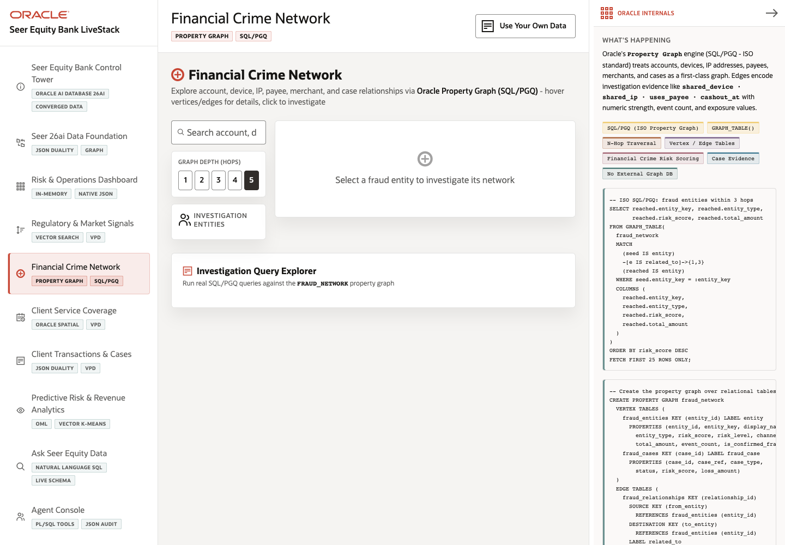

# Scene 5 Financial Crime Network

## Introduction

The Financial Crime Network scene lets investigators explore accounts, devices, IP addresses, payees, merchants, and fraud cases as a property graph. The app uses graph relationships to show why a case or entity deserves attention.

Estimated Time: 10 minutes

### Objectives

In this lab, you will:
- Open the graph investigation scene.
- Search fraud entities and change graph depth.
- Select an entity and inspect its network.
- Review the SQL/PGQ and graph-table evidence.

## Task 1: Open the graph scene

1. Click **Financial Crime Network** in the left navigation.
2. Review the search field labeled **Search account, device, payee, case...**.
3. Review the **Graph Depth (Hops)** control.

Expected result:
- The user sees the graph investigation layout with entity list, depth controls, graph canvas, and Oracle Internals evidence.

## Task 2: Explore a crime network

1. Search for an account, device, payee, merchant, or case when the entity list is populated.
2. Select an investigation entity.
3. Change graph depth from **1** to **2** or **3** hops.
4. Hover or click nodes and edges in the graph canvas.

Expected result:
- The graph expands to show related entities and evidence links.
- Metrics such as nodes, edges, risk, exposure, and connections update for the selected network.

## Task 3: Compare graph evidence with Oracle Internals

1. Review the **Oracle Internals** panel.
2. Point out SQL/PGQ, `GRAPH_TABLE()`, n-hop traversal, vertex and edge tables, and case evidence.
3. Connect the visible network to the SQL snippets in the panel.

Expected result:
- The presenter can explain that the app uses graph queries over Oracle data rather than exporting the fraud workflow to a separate graph database.

## Task 4: Why this matters?

Fraud investigations depend on relationships, not isolated records. This scene shows how graph traversal helps analysts discover connected risk while keeping case evidence inside the governed Oracle data layer.

## Credits & Build Notes
- **Author** - LiveLabs Team
- **Last Updated By/Date** - LiveLabs Team, 2026-05-11
