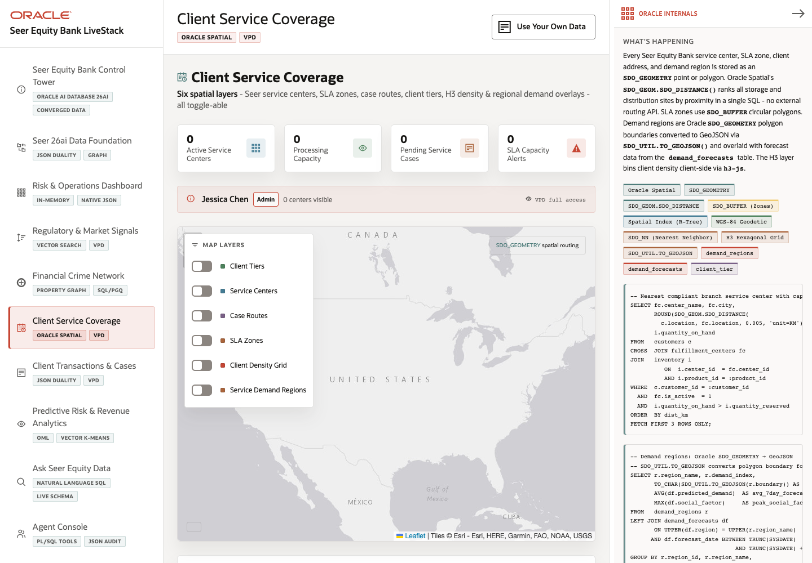

# Scene 6 Client Service Coverage

## Introduction

The Client Service Coverage scene shows how Seer Equity Bank analyzes service centers, SLA zones, client locations, case routes, and demand regions with Oracle Spatial. Operators use the map to understand where service capacity and client demand intersect.

Estimated Time: 10 minutes

### Objectives

In this lab, you will:
- Open the service coverage map.
- Toggle spatial layers and review coverage indicators.
- Review the VPD context banner.
- Inspect Oracle Spatial and row-level security evidence.

## Task 1: Open the coverage map

1. Click **Client Service Coverage** in the left navigation.
2. Review the summary cards for service centers, processing capacity, pending service cases, and SLA capacity alerts.
3. Review the VPD context banner when a demo user is active.

Expected result:
- The scene opens as a map-centered service coverage workflow.
- The user sees whether the current role has full access or region-filtered access.

## Task 2: Compare spatial layers

1. Use the map layer controls to toggle service centers, SLA zones, case routes, client tiers, density, and regional demand overlays.
2. Review the map as layers appear or disappear.
3. Scroll to the **Service Centers** table and compare map visibility with tabular capacity.

Expected result:
- The map changes as layers are toggled.
- With live data loaded, service centers and demand overlays help the user identify coverage gaps or overloaded areas.

## Task 3: Inspect Oracle Internals

1. Review the **Oracle Internals** panel.
2. Point out Oracle Spatial features such as `SDO_GEOMETRY`, `SDO_GEOM.SDO_DISTANCE`, `SDO_BUFFER`, spatial index use, and GeoJSON conversion.
3. Review the VPD section that shows how Oracle filters service data by active user context.

Expected result:
- The user can connect the visible map to Oracle spatial types, distance calculations, service regions, and row-level security.

## Task 4: Why this matters?

Client service planning is a location and capacity problem. This scene shows how Oracle Spatial helps operators reason over real service geography while Oracle security policies keep each user's view governed.

## Credits & Build Notes
- **Author** - LiveLabs Team
- **Last Updated By/Date** - LiveLabs Team, 2026-05-11
