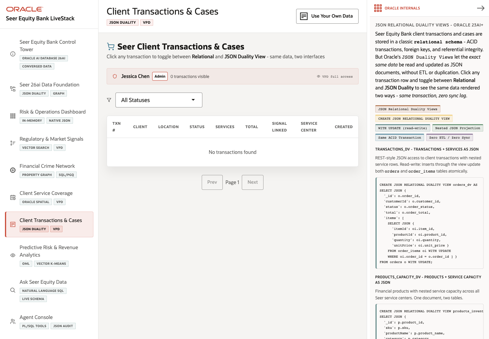

# Scene 7 Client Transactions and Cases

## Introduction

This scene shows transactions and service cases through both relational rows and JSON document views. It demonstrates how Oracle JSON Relational Duality Views can expose the same governed finance data in application-friendly JSON form.

Estimated Time: 10 minutes

### Objectives

In this lab, you will:
- Open the transaction and case list.
- Filter by status.
- Expand a transaction and compare relational data with JSON Duality.
- Inspect VPD and JSON Duality evidence.

## Task 1: Open the transactions scene

1. Click **Client Transactions & Cases** in the left navigation.
2. Review the VPD context banner.
3. Review the status filter labeled **All Statuses**.

Expected result:
- The scene opens with a transaction table and row-level access context.
- With live data loaded, the table lists client transactions and related case information.

## Task 2: Filter and expand a transaction

1. Select a status from **All Statuses**.
2. Click a transaction row.
3. In the expanded panel, compare the relational details with the JSON Duality View tab.
4. Close the expanded transaction and reset the filter when finished.

Expected result:
- The table narrows to the chosen status.
- The expanded transaction shows the same business object through relational fields and JSON document projection.

## Task 3: Inspect Oracle Internals

1. Review the **Oracle Internals** panel.
2. Point out the JSON Relational Duality View explanation and the `ORDERS_DV` evidence.
3. Review the VPD policy function evidence for transaction access.

Expected result:
- The user can explain why application developers can work with JSON while Oracle still owns the normalized transaction model.

## Task 4: Why this matters?

Finance applications often need both relational accuracy and document-style application payloads. JSON Duality lets the same transaction be queried as normalized data or JSON without duplicating the source of truth.

## Credits & Build Notes
- **Author** - LiveLabs Team
- **Last Updated By/Date** - LiveLabs Team, 2026-05-11
