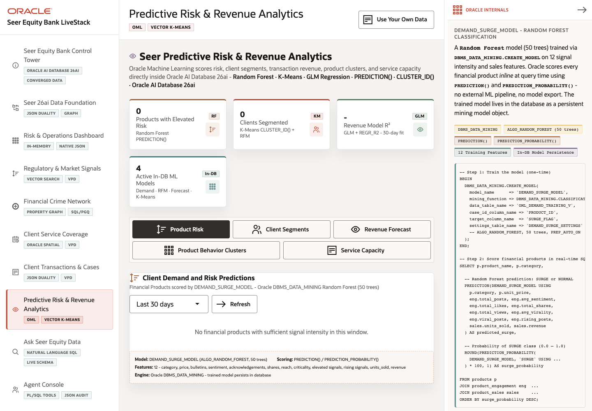

# Scene 8 Predictive Risk and Revenue Analytics

## Introduction

The Predictive Risk & Revenue Analytics scene shows Oracle Machine Learning outcomes inside the operator workflow. The app presents product risk, client segments, revenue forecasts, product behavior clusters, and capacity intelligence from in-database models and SQL analytics.

Estimated Time: 12 minutes

### Objectives

In this lab, you will:
- Open the predictive analytics scene.
- Move through the OML tabs.
- Refresh model-backed panels.
- Inspect the Oracle Internals panel as it changes by tab.

## Task 1: Open predictive analytics

1. Click **Predictive Risk & Revenue Analytics** in the left navigation.
2. Review the summary cards for elevated product risk, client segments, revenue model fit, and active in-database ML models.
3. Review the active tab, usually **Product Risk**.

Expected result:
- The scene opens with finance predictions presented as operator metrics.
- With live data loaded, the cards summarize Oracle Machine Learning output.

## Task 2: Explore the analytics tabs

1. Click **Product Risk** and review the demand or risk scoring panel.
2. Click **Client Segments** and review the RFM segmentation view.
3. Click **Revenue Forecast** and review forecast trend information.
4. Click **Product Behavior Clusters** and review vector or cluster behavior.
5. Click **Service Capacity** and review capacity intelligence.

Expected result:
- The visible panel changes for each tab.
- The Oracle Internals panel also changes to explain the active model or SQL technique.

## Task 3: Refresh a model-backed view

1. On a tab with a **Refresh** button, click **Refresh**.
2. Review any updated chart, table, or summary value.
3. Note the model or SQL function named in the panel, such as `PREDICTION()`, `CLUSTER_ID()`, Random Forest, K-Means, GLM, or regression functions.

Expected result:
- The panel refreshes from the app API.
- The presenter can explain that models persist and score inside Oracle rather than in a separate notebook or service.

## Task 4: Why this matters?

Predictive analytics becomes more actionable when it appears inside the operational application. This scene shows how Oracle Machine Learning results can be served beside live transactions, signals, product data, and service capacity.

## Credits & Build Notes
- **Author** - LiveLabs Team
- **Last Updated By/Date** - LiveLabs Team, 2026-05-11
