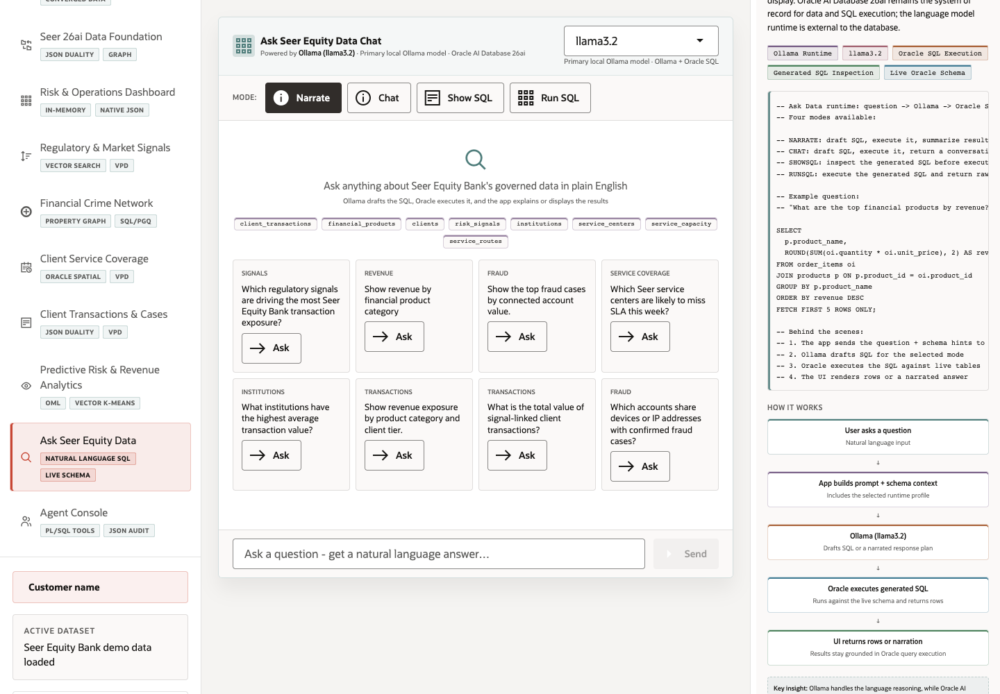

# Scene 9 Ask Seer Equity Data

## Introduction

Ask Seer Equity Data lets users ask plain-English questions over the governed finance schema. Ollama drafts the response plan or SQL, and Oracle AI Database 26ai executes the generated SQL against live data.

Estimated Time: 10 minutes

### Objectives

In this lab, you will:
- Open the natural-language data scene.
- Choose a runtime profile and response mode.
- Ask an example question.
- Inspect generated SQL and Oracle execution evidence.

## Task 1: Open Ask Seer Equity Data

1. Click **Ask Seer Equity Data** in the left navigation.
2. Review the chat header and runtime profile selector.
3. Review the available data surfaces listed in the empty state.

Expected result:
- The scene opens with a guided natural-language query interface.
- The user sees that the language experience is grounded in the finance schema.

## Task 2: Choose mode and ask a question

1. Select a mode such as **Narrate**, **Chat**, **Show SQL**, or **Run SQL**.
2. Click an example **Ask** button, or type a question such as `Which products have the highest risk exposure?`.
3. Click **Send**.

Expected result:
- With the full stack healthy, the app sends the question to Ollama with schema context.
- In **Show SQL** or **Run SQL** mode, the user can inspect generated SQL or returned rows.

## Task 3: Inspect Oracle Internals

1. Review the **Oracle Internals** panel.
2. Follow the flow: user question, app prompt and schema context, Ollama draft, Oracle SQL execution, and UI response.
3. Point out that Oracle remains the source of truth for SQL execution and result retrieval.

Expected result:
- The user can distinguish between LLM reasoning and governed Oracle data execution.

## Task 4: Why this matters?

Natural-language analytics is valuable only when answers stay grounded in governed data. This scene shows a practical pattern: use an LLM for language, keep SQL execution and data trust in Oracle.

## Credits & Build Notes
- **Author** - LiveLabs Team
- **Last Updated By/Date** - LiveLabs Team, 2026-05-11
